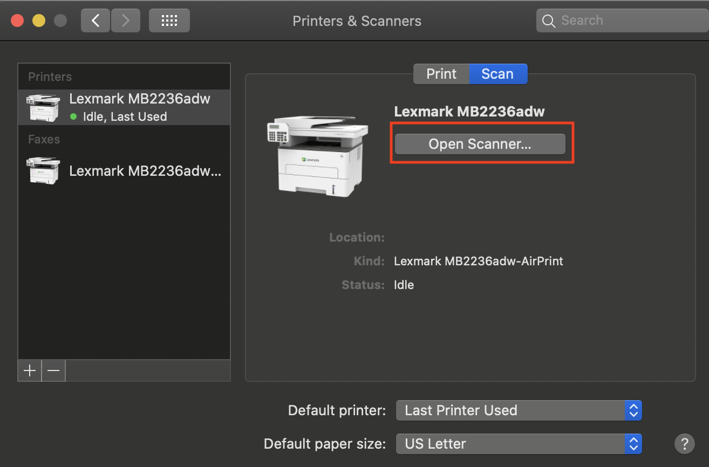

# Automated-Binder-Scanning
Scan front and back pages from binders quickly!

## Usage
1. Clone this repository and install dependencies by running the command:
	```bash
	git clone git@github.com:EKarton/Automated-Binder-Scanning.git
	cd Automated-Binder-Scanning
	virtualenv -p python3 .
	pip3 install -r requirements.txt
	```

2. Make a folder per binder
	
    Example: If you have these two binders:

	Make these folders:
	```
	CSC 384
	GGR 272
	```

3. Break each binder into units:

	Example:
	<div width="100%">
		<p align="center">
	
		</p>
	</div>

4. For each binder, make folders for each unit
	
    Example:
	```
	CSC 384
	└── Unit 1
	└── Unit 2
	└── Unit 3
	└── Unit 4
	└── Unit 5
	└── Unit 6
	└── Unit 7
	```

4. For each unit, make three folders: ```Front pages``` and ```Back pages```:
	
    Example:
	```
	CSC 384
    └── Unit 1
    	└── Front pages
    	└── Back pages
    └── Unit 2
    	└── Front pages
    	└── Back pages
    └── Unit 3
    	└── Front pages
    	└── Back pages
    └── Unit 4
    	└── Front pages
    	└── Back pages
    └── Unit 5
    	└── Front pages
    	└── Back pages
    └── Unit 6
    	└── Front pages
    	└── Back pages
    └── Unit 7
    	└── Front pages
    	└── Back pages
	```

5. Open up your Scanner app, and start scanning the first page of the first unit. Make sure that the scanned images are in ascending order of their page numbers
	
    Example:
	* Put your pages into the scanner:

	<div width="100%">
		<p align="center">
	
		</p>
	</div>

	* Open up your Scanner app:

		On a Mac, it would be under `Spotlight > Printers & Scanners > Printers > Scan > Open Scanner`:

		<div width="100%">
			<p align="center">
		
			</p>
		</div>

		The scanner app on Mac looks like:

		<div width="100%">
			<p align="center">
		
			</p>
		</div>

	* Change the ```Scan Mode``` to ```Document Feeder```:
	<div width="100%">
		<p align="center">
	
		</p>
	</div>
	
	* Change the target folder to the ```Front pages``` of your first unit:

	<div width="100%">
		<p align="center">
	
		</p>
	</div>

	<div width="100%">
		<p align="center">
	
		</p>
	</div>

	* Scan:
	<div width="100%">
		<p align="center">
	
		</p>
	</div>

6. Now, start scanning the back pages of your first unit in **Reversed order** (means that the scanned images are in descending order of their page numbers)
	
    Example:
	* Carefully take your pages out of the document feeder without flipping it over

	* Put the back side of the last page as the first page to scan in your scanner:

	<div width="100%">
		<p align="center">
	
		</p>
	</div>

	* Change the output directory in your Scanner app to ```Back pages``` of your first unit:

	<div width="100%">
		<p align="center">
	
		</p>
	</div>

	<div width="100%">
		<p align="center">
	
		</p>
	</div>

	* Scan:
	<div width="100%">
		<p align="center">
	
		</p>
	</div>

7. Go back to step 5 for the rest of your units
	* NOTE: Sometimes scanners jam / skip pages. To resolve this, delete the folder with the failed unit and redo scanning the front and back pages

8. On a MacOS, the first page scanned is named ```Scan.jpeg``` while the second page is named ```Scan 1.jpeg```. We need ```Scan.jpeg``` to be ```Scan 0.jpeg```. To resolve this, run the command:
	```bash
	find . -name "Scan.jpeg" -print0 | while read -d $'\0' file; do dir=$(dirname "${file}"); echo $dir; mv "${file}"  "${dir}/Scan 0.jpeg"; done
	```

9. Copy your scanned binder to the ```scans``` directory in repo. 

10. In the terminal, run:
	```
	source bin/activate
	python3 scripts/run.py
	```