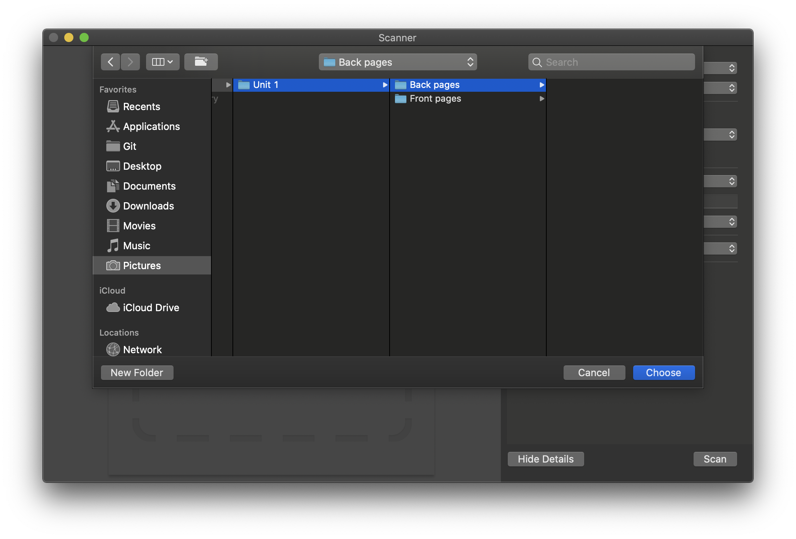
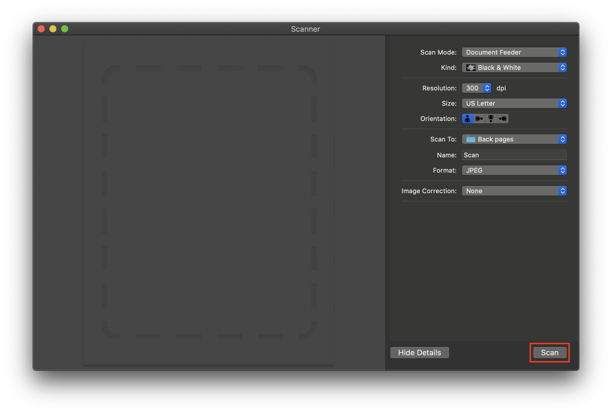

### How to scan the back pages of your unit

Example:

1. After scanning the front pages of your unit, carefully take out your scanned pages from your scanner without changing with its page order

2. Put the back side of the last page as the first page to scan in your scanner:

	<div width="100%">
		<p align="center">
	
		</p>
	</div>

3. Change the output directory in your Scanner app to ```Back pages``` of your first unit:

	<div width="100%">
		<p align="center">
	
		</p>
	</div>

	<div width="100%">
		<p align="center">
	
		</p>
	</div>

4. Scan:
	<div width="100%">
		<p align="center">
	
		</p>
	</div>