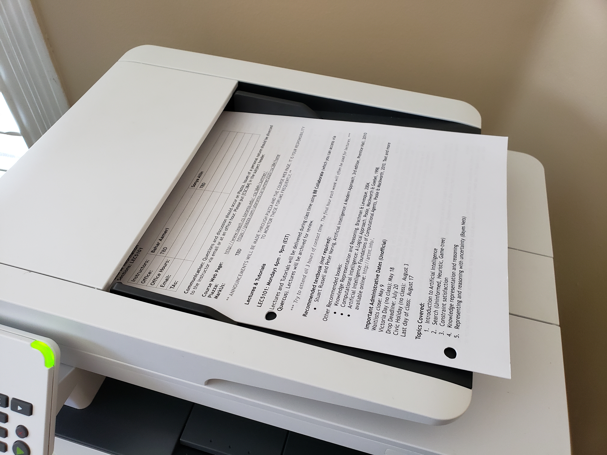
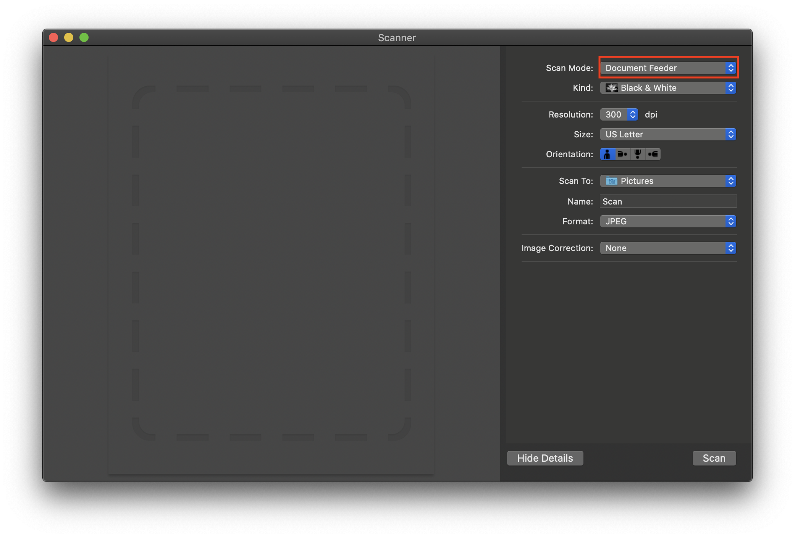

### How to scan the front pages of your unit

Example:

1. Put your pages into the scanner where the front page of your first unit is at the top:

<div width="100%">
    <p align="center">

    </p>
</div>


2. Change the ```Scan Mode``` to ```Document Feeder```:
    <div width="100%">
        <p align="center">
    
        </p>
    </div>
    
3. Change the target folder to the ```Front pages``` of your first unit:

    <div width="100%">
        <p align="center">
    
        </p>
    </div>

    <div width="100%">
        <p align="center">
    
        </p>
    </div>

4. Click the Scan button:
    <div width="100%">
        <p align="center">
    
        </p>
    </div>
